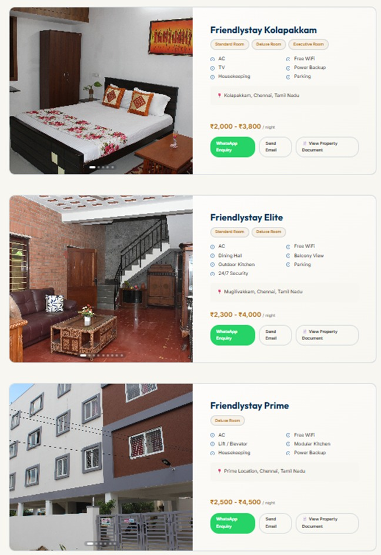
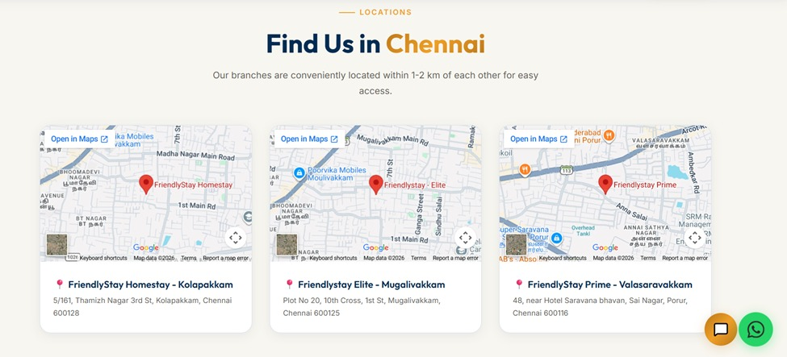
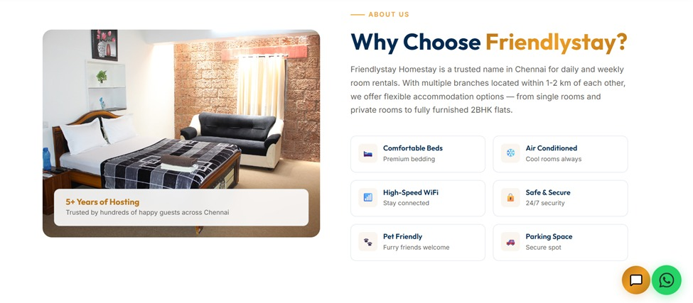

# 🏠 FriendlyStay Homestay - Full Stack Application

[](https://www.docker.com/)
[](https://react.dev/)
[](https://www.typescriptlang.org/)
[](https://laravel.com/)
[](https://vitejs.dev/)

**FriendlyStay** is a luxury homestay and short-term apartment rental platform serving guests across Chennai (Mugilivakkam, Kolapakkam, and Prime locations). Built with a modern **React 19 + TypeScript** frontend and a **Laravel 11 REST API** backend, fully containerized using **Docker Compose** or ready for 1-click **Hostinger SSH Deployment**.

---

## 🖼️ Application Screenshots & Previews

### 📱 Full-Stack Overview & Device Preview


### 🏢 Property Listings, Pricing & Downloads


### 📍 Interactive Location Maps in Chennai (Mugilivakkam, Kolapakkam & Valasaravakkam)


### ✨ Features & Amenities Showcase


---

## ✨ Key Features & Highlights

### 🌐 Frontend (Guest Portal)
* **Luxury Design System**: Navy (`#0C447C`) & Warm Gold (`#EF9F27`) aesthetic with frosted glassmorphism (`backdrop-filter: blur`).
* **Circular Logo**: Styled circular branding frame with gold border accents and dynamic hover rotation.
* **Responsive Layouts**: Fixed navbar, mobile drawer menu, zero floating-button collision, and optimized touch swipe carousels.
* **Interactive Property Listings**:
  * Multi-photo swipeable carousels.
  * Location filter tabs (`Mugilivakkam`, `Kolapakkam`, `Prime`).
  * Price per night ranges (`₹2,300 - ₹4,000 / night`).
  * Direct **WhatsApp Enquiry**, **Email Booking**, and **Brochure PDF Downloads**.
* **Guest Reviews System**: Filter reviews by category, view star ratings, and submit new guest feedback.
* **Floating AI Chatbot & WhatsApp**: Instant booking assistance widget.

### ⚙️ Backend & Admin Management
* **Laravel 11 REST API**: Clean controller architecture for properties, enquiries, and guest reviews.
* **JWT Authentication**: Secure token-based authentication for admin routes.
* **Admin Control Panel** (`/admin`):
  * **Guest Enquiries Management**: Real-time enquiries list with direct WhatsApp / Email response triggers.
  * Review approvals, rejections, and direct replies.
  * Property pricing updates and document brochure uploads.
  * CSV export for enquiry leads.

---

## 🌐 Hostinger SSH 1-Command Deployment

For step-by-step documentation, see **[docs/HOSTINGER_SSH_DEPLOYMENT.md](docs/HOSTINGER_SSH_DEPLOYMENT.md)**.

```bash
# 1. Connect via SSH to Hostinger
ssh u363724345@green-quail-458567.hostingersite.com

# 2. Clone project into public_html
cd public_html
git clone https://github.com/jessisam/Friendlystay.git .

# 3. Configure MySQL credentials in friendlystay-laravel/.env
nano friendlystay-laravel/.env

# 4. Run automated 1-command deployment
chmod +x deploy.sh
./deploy.sh
```

---

## 🛠️ Technology Stack

| Domain | Technologies Used |
|---|---|
| **Frontend** | React 19, TypeScript, Vite, React Router DOM 7, Lucide Icons, Framer Motion |
| **Backend** | Laravel 11, PHP 8.2, Nginx, Firebase JWT |
| **Database** | SQLite (Zero-Config local/dev) / MySQL |
| **DevOps / Hosting** | Hostinger SSH, Docker Compose, Multi-stage Nginx static build |

---

## 🚀 Local Development with Docker Compose

```bash
# Clone & Start Full-Stack Environment
git clone https://github.com/jessisam/Friendlystay.git
cd Friendlystay
docker compose up -d --build
```

---

## 🔐 Admin Credentials

| Field | Value |
|---|---|
| **Admin Login URL** | `http://localhost:3000/admin` / `https://green-quail-458567.hostingersite.com/admin` |
| **Username** | `admin` |
| **Password** | `admin123` |

---

## 📁 Repository Structure

```
Friendlystay/
├── deploy.sh                      # Hostinger SSH 1-command deployment script
├── docker-compose.yml             # Unified Docker Compose configuration
├── docs/
│   ├── HOSTINGER_SSH_DEPLOYMENT.md# Hostinger SSH Deployment Guide
│   └── screenshots/               # Application screenshots
├── friendlystay-react/            # React 19 Frontend
└── friendlystay-laravel/          # Laravel 11 Backend API
```

---

## 📄 License
Created for **FriendlyStay Homestay**. All rights reserved.
