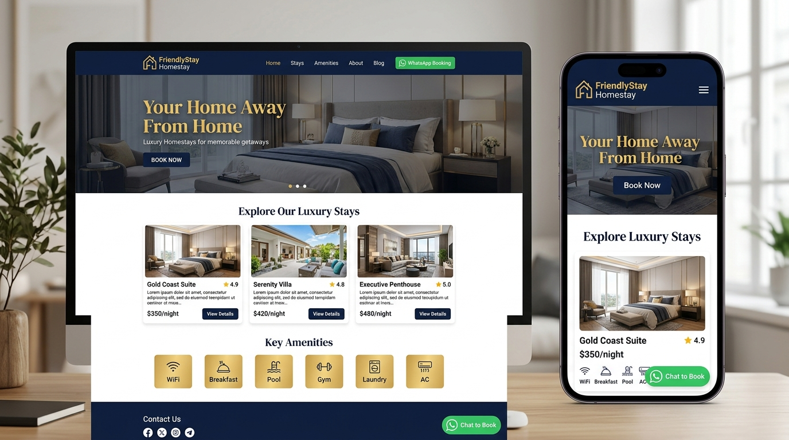

# 🏠 FriendlyStay Homestay - Full Stack Application

[](https://www.docker.com/)
[](https://react.dev/)
[](https://www.typescriptlang.org/)
[](https://laravel.com/)
[](https://vitejs.dev/)

**FriendlyStay** is a luxury homestay and short-term apartment rental platform serving guests across Chennai (Mugilivakkam, Kolapakkam, and Prime locations). Built with a modern **React 19 + TypeScript** frontend and a **Laravel 11 REST API** backend, fully containerized using **Docker Compose**.

---

## 🖼️ Website Preview



---

## ✨ Features & Highlights

### 🌐 Frontend (Guest Portal)
* **Luxury Design System**: Navy (`#0C447C`) & Warm Gold (`#EF9F27`) aesthetic with frosted glassmorphism (`backdrop-filter: blur`).
* **Responsive Layouts**: Fixed navbar, mobile drawer menu, zero floating-button collision, and optimized touch swipe carousels.
* **Interactive Property Listings**:
  * Multi-photo swipeable carousels.
  * Location filter tabs (`Mugilivakkam`, `Kolapakkam`, `Prime`).
  * Price per night ranges (`₹2,300 - ₹4,000 / night`).
  * Direct **WhatsApp Enquiry**, **Email Booking**, and **Brochure PDF Downloads**.
* **Guest Reviews System**: Filter reviews by category, view star ratings, and submit new guest feedback.
* **Floating AI Chatbot & WhatsApp**: Instant booking assistance widget.

### ⚙️ Backend & Admin Management
* **Laravel 11 REST API**: Clean controller architecture for properties, enquiries, and guest reviews.
* **JWT Authentication**: Secure token-based authentication for admin routes.
* **Admin Control Panel** (`/admin`):
  * Real-time enquiries & review analytics.
  * Review approvals, rejections, and direct replies.
  * Property pricing updates and document brochure uploads.
  * CSV export for enquiry leads.

---

## 🛠️ Technology Stack

| Domain | Technologies Used |
|---|---|
| **Frontend** | React 19, TypeScript, Vite, React Router DOM 7, Lucide Icons, Framer Motion |
| **Backend** | Laravel 11, PHP 8.2, Nginx, Firebase JWT |
| **Database** | SQLite (Zero-Config local/dev) / MySQL |
| **DevOps / Containers** | Docker, Docker Compose, Multi-stage Nginx static build |

---

## 🚀 Quick Start with Docker Compose

### Prerequisites
* [Docker Desktop](https://www.docker.com/products/docker-desktop/) (includes Docker Compose)
* [Git](https://git-scm.com/)

### Installation & Launch

1. **Clone Repository**:
   ```bash
   git clone https://github.com/jessisam/Friendlystay.git
   cd Friendlystay
   ```

2. **Spin Up Full-Stack Environment**:
   ```bash
   docker compose up -d --build
   ```

3. **Database Migration & Seeding** *(Automatic/Manual)*:
   ```bash
   docker exec friendlystay_backend php artisan migrate:fresh --seed --force
   ```

4. **Access Applications**:
   * 🌐 **React Frontend**: [http://localhost:3000](http://localhost:3000)
   * 🏢 **Properties Page**: [http://localhost:3000/properties](http://localhost:3000/properties)
   * 🔐 **Admin Portal**: [http://localhost:3000/admin](http://localhost:3000/admin)
   * 📡 **Laravel Backend API**: [http://localhost:8000/api/health](http://localhost:8000/api/health)

---

## 🔐 Admin Credentials

| Field | Value |
|---|---|
| **Admin Login URL** | `http://localhost:3000/admin` |
| **Username** | `admin` |
| **Password** | `admin123` |

---

## 📁 Repository Structure

```
Friendlystay/
├── docker-compose.yml             # Unified Docker Compose configuration
├── docs/
│   └── screenshots/               # Website preview screenshots
│       └── website_preview.jpg
├── friendlystay-react/            # React 19 Frontend
│   ├── Dockerfile                 # Multi-stage Nginx Dockerfile
│   ├── nginx.conf                 # SPA routing configuration
│   ├── src/
│   │   ├── admin/                 # Admin Dashboard components
│   │   ├── components/            # Navbar, Footer, Hero, Chatbot
│   │   ├── config/                # API base URL configuration
│   │   ├── pages/                 # Home, Properties, Reviews, Contact
│   │   └── index.css              # Navy & Gold CSS design tokens
│   └── public/                    # Assets, Property images & Brochures
└── friendlystay-laravel/          # Laravel 11 Backend API
    ├── Dockerfile                 # PHP 8.2 FPM Dockerfile
    ├── app/Http/Controllers/Api/  # Auth, Property, Review, Enquiry APIs
    └── database/seeders/          # Friendlystay Elite & initial property seeders
```

---

## 📄 License
Created for **FriendlyStay Homestay**. All rights reserved.
